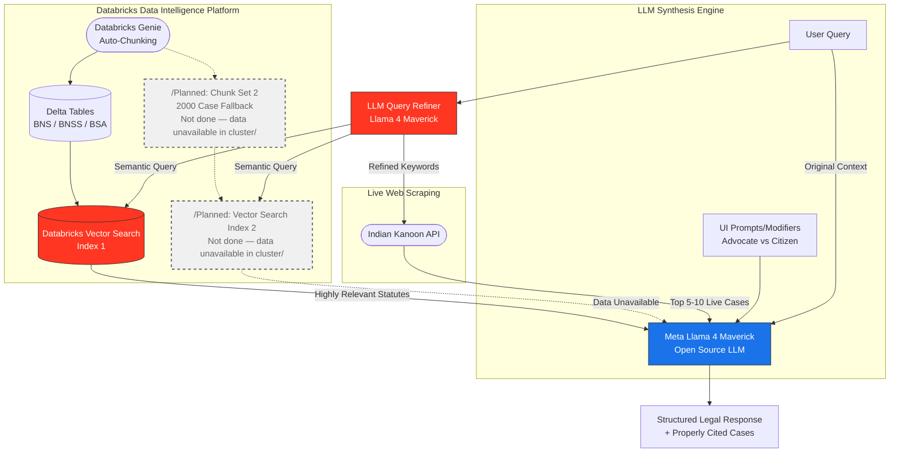
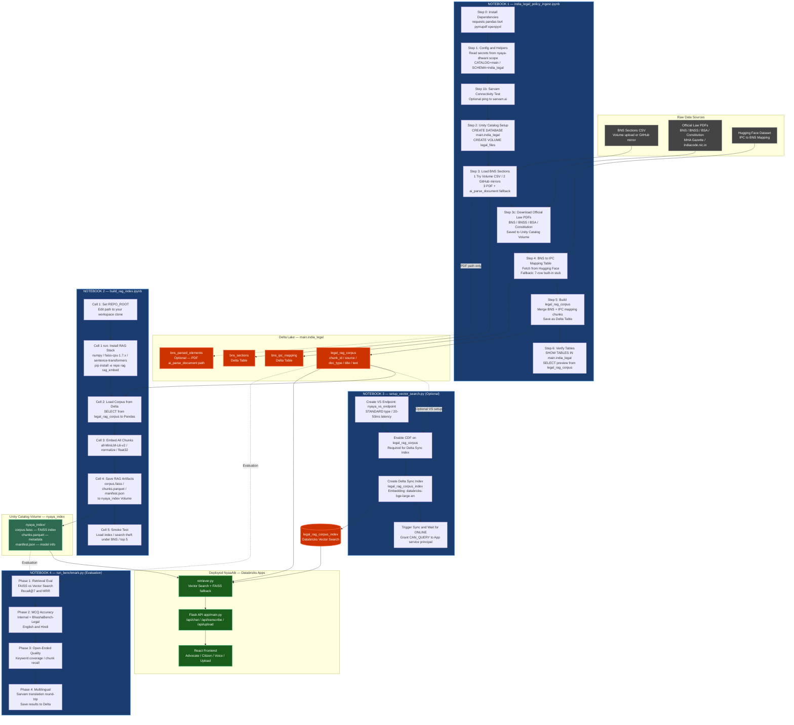

# NyaaAIk — AI-Powered Legal Research Assistant

> **Bharat Bricks Hacks 2026 · IIT Delhi**
> Built on Databricks · Powered by Meta Llama 4 Maverick · Indian Law RAG

## 📖 Project Story & Motivation

The motivation behind NyaaAIk is to democratize the accessibility and affordability of legal resources in India. Navigating the Indian judicial system can be daunting and prohibitively expensive for the average citizen.

NyaaAIk is a **Databricks-native legal assistant** using **Llama 4 Maverick** and **Sarvam Saaras v3**. It employs a state-of-the-art Hybrid RAG architecture: Databricks Genie autonomously chunks statutory laws into Delta Tables, synced natively with Vector Search. Simultaneously, an LLM refines user queries for parallel semantic vector retrieval and live web scraping of recent rulings. This bridges the gap—providing courtroom-grade insight to advocates while translating complex statutory laws into actionable, plain-language guidance for everyday citizens.

---

## What is NyaaAIk?

NyaaAIk is an AI legal assistant for Indian users that:
- Searches the **Bharatiya Nyaya Sanhita (BNS)**, BNSS, and BSA using RAG
- Finds live **court judgments** from Indian Kanoon
- Understands **voice in Hindi, Tamil, Bengali, Telugu** and 7 more Indian languages (Sarvam Saaras v3)
- Analyzes **uploaded PDFs, Word docs, and screenshots** using Llama 4 Maverick vision
- Responds in two modes: **Advocate** (courtroom English) and **Citizen** (plain language)
- Works in **Dark and Light themes**

---

## Tech Stack

| Layer | Tool | Purpose |
|---|---|---|
| **LLM** | Meta Llama 4 Maverick (via Databricks AI Gateway) | Chat, RAG answers, document vision |
| **Vector Search** | Databricks Vector Search | Semantic search over BNS/BNSS/BSA legal corpus |
| **Live Cases** | Indian Kanoon API | Real-time court judgment retrieval |
| **STT** | Sarvam Saaras v3 (`saaras:v3`) | Indian language voice → text (10 languages) |
| **Backend** | Python + Flask | REST API server |
| **Frontend** | React + Vite | Single-page app |
| **Deployment** | Databricks Apps | Hosting on Databricks workspace |
| **Secrets** | Databricks Secret Scopes | Secure API key storage |
| **Storage** | In-memory (per-session) | Uploaded documents + chat context |
| **Persistence** | Browser localStorage | Chat history across sessions |

---

## 🏛️ System Architecture & Data Flow



*Note: Highlighted components leverage the open-source Meta Llama 4 Maverick model and extensive Databricks enterprise infrastructure.*

---

## 🗃️ Databricks Notebook Pipeline — How We Build the RAG Index

The entire data pipeline that powers NyaaAIk's legal knowledge base is run through **two Databricks notebooks**, executed in sequence inside the workspace. The diagram below shows exactly what each notebook does and how data flows end-to-end from raw law files to the deployed app.

### End-to-End Pipeline Diagram



---

## 🚀 Running on Databricks — Notebook-by-Notebook Guide

Follow these steps **in order** inside your Databricks workspace. No local Python needed for data setup.

---

### Prerequisites

Before running any notebook, ensure:

- [ ] Databricks workspace with **Unity Catalog** enabled
- [ ] Secret scope `nyaya-dhwani` created (see [Deployment Step 4](#step-4--set-up-databricks-secret-scope)) containing:
  - `sarvam_api_key`
  - `indian_kanoon_api_token`
  - `datagov_api_key` *(optional)*
- [ ] Repo cloned into **Workspace → Repos** (see [Step 8](#step-8--connect-repo-to-databricks-workspace))
- [ ] A compute cluster or Serverless notebook attached

---

### ⚠️ First-Time Workspace Setup — If You Get `catalog 'main' not found`

This error means either:
- Unity Catalog is not fully configured in your workspace, **or**
- The `main` catalog doesn't exist yet, **or**
- You are on a trial workspace that uses a different default catalog name

**Fix Option A — Create the catalog and schema manually (recommended):**

Open any Databricks notebook, attach to a cluster, and run this **before** Notebook 1:

```sql
-- Run this in a SQL cell or notebook
CREATE CATALOG IF NOT EXISTS main;
CREATE SCHEMA  IF NOT EXISTS main.india_legal;
CREATE VOLUME  IF NOT EXISTS main.india_legal.legal_files;
```

Or via the UI: **Catalog → + Add → Add a catalog** → name it `main` → Create.

**Fix Option B — Use your own catalog name:**

If your workspace has a different catalog (e.g. `hive_metastore` or a custom one), open Notebook 1 and **edit Step 1** to change:

```python
CATALOG  = 'main'        # ← change to your catalog name, e.g. 'hive_metastore'
SCHEMA   = 'india_legal' # ← keep as-is or rename
VOLUME   = 'legal_files' # ← keep as-is or rename
```

> ⚠️ If you change `CATALOG`, also update `app.yaml` and `setup_vector_search.py` to use the same name consistently.

**Verify Unity Catalog is active:**
```sql
SHOW CATALOGS;
-- Should list 'main' and your workspace catalog
```

---

### NOTEBOOK 1 — Data Ingestion

**File:** `notebooks/india_legal_policy_ingest.ipynb`

Open this notebook in your Databricks workspace. Run **each cell in order**:

| Cell | What It Does |
|------|-------------|
| **Step 0** | Installs Python packages: `requests`, `pandas`, `beautifulsoup4`, `lxml`, `openpyxl`, `pymupdf` |
| **Step 1** | Reads secrets from `nyaya-dhwani` scope. Sets `CATALOG=main`, `SCHEMA=india_legal`, `VOLUME=legal_files` |
| **Step 1b** *(optional)* | Pings Sarvam API with a test message to confirm the key works |
| **Step 2** | Creates `main.india_legal` schema and `legal_files` Volume. **If you get `catalog not found`** — run the [First-Time Setup](#️-first-time-workspace-setup--if-you-get-catalog-main-not-found) SQL above first, or change `CATALOG` in Step 1 |
| **Step 3** | Loads BNS sections — tries Volume CSV first, then GitHub mirrors, then PDF fallback |
| **Step 3a** | GitHub mirror fallback (only runs if Step 3 Volume CSV is missing) |
| **Step 3b** | PDF + `ai_parse_document` + Sarvam enrichment (only if CSV and mirrors both fail) |
| **Step 3c** | Downloads official law PDFs from MHA Gazette to the Unity Catalog Volume |
| **Step 3d** | Saves `bns_sections` as a Delta table |
| **Step 4** | Fetches BNS ↔ IPC mapping from Hugging Face. Falls back to a 7-row built-in stub |
| **Build Corpus** | Merges all sources into `legal_rag_corpus` Delta table (`chunk_id`, `source`, `doc_type`, `title`, `text`) |
| **Verify** | `SHOW TABLES` + preview query to confirm data is populated |

**Expected output after this notebook:**
```
✅ Schema : main.india_legal
✅ Volume : /Volumes/main/india_legal/legal_files
🏛️  legal_rag_corpus: <N> total chunks
  BNS_2023         → <N> rows
  BNS_IPC_MAPPING  → <N> rows
```

> 💡 **Tip — Manual CSV upload**: If Step 3 fails to find a BNS CSV, download one from  
> [Kaggle: Bharatiya Nyaya Sanhita Dataset](https://www.kaggle.com/datasets/nandr39/bharatiya-nyaya-sanhita-dataset-bns),  
> upload via **Catalog → Volumes → legal_files → Upload to this volume**, then re-run Step 3.

---

### NOTEBOOK 2 — Build the RAG Index

**File:** `notebooks/build_rag_index.ipynb`

> ⚠️ **Run this notebook AFTER Notebook 1 completes** — it reads from `legal_rag_corpus`.

Open this notebook in Databricks. Run **each cell in order**:

| Cell | What It Does |
|------|-------------|
| **Cell 1 — Edit REPO_ROOT** | Set `REPO_ROOT` to your cloned repo path. Right-click the repo in the Workspace sidebar → **Copy path**. Example: `/Workspace/Users/you@domain.com/nyaya-dhwani-hackathon` |
| **Cell 1 — Run** | Installs RAG stack: `numpy<2`, `faiss-cpu<1.8`, `sentence-transformers`, `pyarrow`, `pandas`. Then runs `pip install -e <REPO_ROOT>[rag,rag_embed]` to make `import nyaya_dhwani` work |
| **Cell 2** | Loads corpus from Delta: `main.india_legal.legal_rag_corpus` → Pandas DataFrame |
| **Cell 3** | Embeds all text chunks using `sentence-transformers/all-MiniLM-L6-v2` with L2 normalization |
| **Cell 4** | Saves three RAG artifacts to the Unity Catalog Volume |
| **Cell 5** | Smoke test: loads the index and runs `"What is theft under BNS?"` → prints top-5 results |

**Expected output:**
```
✅ pip: numpy 1.x, pandas<3, faiss-cpu 1.7.x, pyarrow, sentence-transformers
✅ import nyaya_dhwani → /Workspace/Users/.../src/nyaya_dhwani
✅ import faiss OK
(<N_chunks>, 384)   ← embedding dimensions
✅ Artifacts saved to /Volumes/main/india_legal/legal_files/nyaya_index/
```

**Output artifacts saved to:**
```
/Volumes/main/india_legal/legal_files/nyaya_index/
├── corpus.faiss      ← FAISS similarity index
├── chunks.parquet    ← chunk metadata (id, source, title, text)
└── manifest.json     ← embedding model name, catalog, schema, timestamp
```

> 💡 **If `import nyaya_dhwani` fails**: Ensure `REPO_ROOT` exactly matches the path shown in the Workspace sidebar. Do **not** add `%restart_python` in the install cell — it breaks the kernel before later cells run.

---

### After Both Notebooks Complete

The `retriever.py` module in the deployed app automatically loads the FAISS index from the Volume path. No additional steps are needed — just deploy the app as described in Steps 9–10 below.

---

## Repository Structure

```
nyaya-dhwani-hackathon/
│
├── app/
│   ├── main.py              ← Flask backend (all API routes)
│   └── static/              ← Built React app (DO NOT edit manually)
│       ├── index.html
│       └── assets/
│
├── notebooks/
│   ├── india_legal_policy_ingest.ipynb  ← NOTEBOOK 1: Data ingestion → Delta tables
│   ├── build_rag_index.ipynb            ← NOTEBOOK 2: Build FAISS index → Volume
│   ├── setup_vector_search.py           ← NOTEBOOK 3: Create VS endpoint + Delta Sync index (optional)
│   └── run_benchmark.py                 ← NOTEBOOK 4: RAG evaluation — retrieval / MCQ / multilingual
│
├── frontend/
│   ├── src/
│   │   ├── App.jsx          ← Root component + theme + state
│   │   ├── index.css        ← All styles (dark + light themes)
│   │   ├── components/
│   │   │   ├── Topbar.jsx        ← Header + theme toggle
│   │   │   ├── Sidebar.jsx       ← Chat history + docs list
│   │   │   ├── ControlsBar.jsx   ← Persona + Court + Style controls
│   │   │   ├── TopicsChips.jsx   ← Quick topic selector
│   │   │   ├── WelcomeScreen.jsx ← First-load suggestions
│   │   │   ├── ChatWindow.jsx    ← Message thread
│   │   │   ├── InputBar.jsx      ← Text input + mic + upload
│   │   │   └── UploadModal.jsx   ← Document upload UI
│   │   ├── hooks/
│   │   │   ├── useChat.js        ← Chat state + API calls
│   │   │   └── useSarvamVoice.js ← MediaRecorder → Sarvam STT
│   │   └── utils/
│   │       ├── api.js            ← All fetch calls to Flask
│   │       └── icons.jsx         ← SVG icon components
│   ├── package.json
│   └── vite.config.js
│
├── src/
│   └── nyaya_dhwani/
│       ├── sarvam_client.py  ← Sarvam API helpers (STT, TTS, translate)
│       ├── llm_client.py     ← Maverick LLM calls
│       ├── retriever.py      ← Databricks Vector Search + FAISS fallback
│       └── case_search.py    ← Indian Kanoon API integration
│
├── app.yaml                  ← Databricks App config
├── setup_secrets.py          ← Script to create secret scope
└── README.md
```

---

## Complete Deployment Guide (Step by Step)

Follow **every step** in order. Do not skip.

---

### STEP 1 — Prerequisites

Before starting, make sure you have:

- [ ] A Databricks workspace (Community Edition will NOT work — you need Databricks Apps access)
- [ ] Access to **Databricks AI Gateway** with Llama 4 Maverick configured
- [ ] A **Vector Search endpoint** with the BNS legal corpus indexed
- [ ] An **Indian Kanoon API token** → get it from [indiankanoon.org](https://api.indiankanoon.org/)
- [ ] A **Sarvam API key** → get it from [dashboard.sarvam.ai](https://dashboard.sarvam.ai/)
- [ ] Git installed locally
- [ ] Node.js 18+ installed locally (for building the frontend)

---

### STEP 2 — Clone the Repository

```bash
git clone https://github.com/gaganTakIITD/NyaaAIk.git
cd NyaaAIk
```

---

### STEP 3 — Configure `app.yaml`

Open `app.yaml`. Update the values to match your Databricks workspace:

```yaml
command: ["python", "app/main.py"]

env:
  - name: LLM_OPENAI_BASE_URL
    value: "https://<YOUR-GATEWAY-ID>.ai-gateway.cloud.databricks.com/mlflow/v1"

  - name: LLM_MODEL
    value: "databricks-llama-4-maverick"

  - name: NYAYA_RETRIEVAL_BACKEND
    value: "vector_search"

  - name: NYAYA_VS_ENDPOINT_NAME
    value: "nyaya_vs_endpoint"         # ← your Vector Search endpoint name

  - name: NYAYA_VS_INDEX_NAME
    value: "main.india_legal.legal_rag_corpus_index"  # ← your index

  - name: SARVAM_STT_MODEL
    value: "saaras:v3"
```

> ⚠️ **Do NOT put API keys here.** They are loaded from Databricks Secrets (Step 4).

---

### STEP 4 — Set Up Databricks Secret Scope

This stores API keys securely. Run the following in a **Databricks notebook** (not locally):

**Cell 1 — Get workspace context**
```python
import requests

ctx   = dbutils.notebook.entry_point.getDbutils().notebook().getContext()
HOST  = ctx.apiUrl().get()
TOKEN = ctx.apiToken().get()
HEADERS = {"Authorization": f"Bearer {TOKEN}"}
print("Host:", HOST)
```

**Cell 2 — Create the secret scope**
```python
r = requests.post(f"{HOST}/api/2.0/secrets/scopes/create",
    headers=HEADERS,
    json={"scope": "nyaya-dhwani", "initial_manage_principal": "users"})
print(r.status_code, r.text)
# 200 = created   |   RESOURCE_ALREADY_EXISTS = already exists (both OK)
```

**Cell 3 — Store Indian Kanoon API token**
```python
r = requests.post(f"{HOST}/api/2.0/secrets/put",
    headers=HEADERS,
    json={
        "scope": "nyaya-dhwani",
        "key":   "indian_kanoon_api_token",
        "string_value": "YOUR_INDIAN_KANOON_TOKEN_HERE"
    })
print(r.status_code, r.text)
```

**Cell 4 — Store Sarvam API key**
```python
r = requests.post(f"{HOST}/api/2.0/secrets/put",
    headers=HEADERS,
    json={
        "scope": "nyaya-dhwani",
        "key":   "sarvam_api_key",
        "string_value": "YOUR_SARVAM_API_KEY_HERE"
    })
print(r.status_code, r.text)
```

**Cell 5 — Verify**
```python
r = requests.get(f"{HOST}/api/2.0/secrets/list?scope=nyaya-dhwani", headers=HEADERS)
print(r.json())
# Expected: {'secrets': [{'key': 'indian_kanoon_api_token', ...}, {'key': 'sarvam_api_key', ...}]}
```

> ✅ Values always show as `[REDACTED]` in Databricks — that is correct behaviour.

---

### STEP 5 — Add App Resources (Grant Secret Access)

In the Databricks Apps UI, before deploying, add both secrets as **resources** so the app's service principal can read them:

1. Go to **Compute → Apps → (your app) → Resources**
2. Add first resource:
   - Secret scope: `nyaya-dhwani`
   - Secret key: `indian_kanoon_api_token`
   - Permission: `Can read`
   - Resource key: `secret1`
3. Add second resource:
   - Secret scope: `nyaya-dhwani`
   - Secret key: `sarvam_api_key`
   - Permission: `Can read`
   - Resource key: `secret2`

> ⚠️ Without these resource declarations, the app cannot read the secrets even if they exist in the scope.

---

### STEP 5b — Run Notebook 1: Data Ingestion (inside Databricks)

1. Navigate to **Workspace → Repos → NyaaAIk → notebooks**
2. Open `india_legal_policy_ingest.ipynb`
3. Attach to a cluster (Standard or Serverless)
4. Run **all cells in order** — see the [Notebook 1 guide above](#notebook-1--data-ingestion)

---

### STEP 5c — Run Notebook 2: Build RAG Index (inside Databricks)

> Run this **after Notebook 1 completes** successfully.

1. Navigate to **notebooks → build_rag_index.ipynb**
2. **Edit `REPO_ROOT`** in Cell 1 to match your workspace path
3. Run **all cells in order** — see the [Notebook 2 guide above](#notebook-2--build-the-rag-index)

---

### STEP 6 — Build the Frontend (Run Locally)

The built files must be committed to git. **Run this on your local machine** (not Databricks):

```bash
cd frontend
npm install
npm run build
cd ..
```

This outputs compiled files to `app/static/`. Verify:
```
app/static/index.html          ← must exist
app/static/assets/index-*.js   ← must exist
app/static/assets/index-*.css  ← must exist
```

> ⚠️ **Never run `npm run build` on Databricks** — Node.js is not available there.

---

### STEP 7 — Push to GitHub

```bash
git add -A
git commit -m "deploy: update config and frontend build"
git push origin main
```

---

### STEP 8 — Connect Repo to Databricks Workspace

1. In your Databricks workspace, go to **Workspace → Repos → Add Repo**
2. URL: `https://github.com/gaganTakIITD/NyaaAIk.git`
3. Click **Create Repo**
4. After creation, click **Pull** to get the latest code

---

### STEP 9 — Deploy the App

1. Go to **Compute → Apps → Create App**
2. Choose **Custom App**
3. Set **Source** to the repo you added in Step 8
4. Set **App file**: `app.yaml`
5. Add the two secret resources (Step 5)
6. Click **Deploy**

The app starts. Watch the **Logs** tab for:
```
INFO - Indian Kanoon API: configured
INFO - Sarvam STT (Saaras): configured
INFO - Starting NyaaAIk on 0.0.0.0:8000
```

If you see `NOT configured` for any key → re-check Steps 4 and 5.

---

### STEP 10 — Access the App

Click the URL shown in the Apps dashboard. You should see the NyaaAIk interface.

---

## What to Do After Any Code Change

Every time you change code locally:

```bash
# If you changed frontend code (React/CSS):
cd frontend
npm run build
cd ..

# Always:
git add -A
git commit -m "your message"
git push origin main

# Then in Databricks:
# Workspace → Repos → NyaaAIk → Pull
# Compute → Apps → NyaaAIk → Deploy (or Restart)
```

---

## What NOT to Do

| ❌ Don't | ✅ Do instead |
|---|---|
| Put API keys in `app.yaml` | Use Databricks Secret Scope (Step 4) |
| Edit files inside `app/static/` manually | Edit source in `frontend/src/`, then `npm run build` |
| Run `npm run build` on Databricks | Build locally, commit the output |
| Commit after editing source but before building | Always build before committing |
| Use Windows line endings (CRLF) for Python/YAML | Keep `.gitattributes` — it enforces LF |
| Skip the resource declarations (Step 5) | Always add both secrets as App Resources |
| Run Notebook 2 before Notebook 1 finishes | Wait for `legal_rag_corpus` table to be created first |

---

## API Endpoints

| Endpoint | Method | Purpose |
|---|---|---|
| `/api/chat` | POST | Main RAG query (persona, court, style, history, doc_ids) |
| `/api/upload` | POST | Upload PDF/DOCX/image for context |
| `/api/transcribe` | POST | Audio blob → Sarvam Saaras STT → transcript |
| `/api/topics` | GET | Legal topic seeds for quick chips |
| `/api/health` | GET | Health check |
| `/api/documents/:id` | DELETE | Remove an uploaded document |

---

## Features Reference

### Persona
| Persona | Response style |
|---|---|
| **Advocate** | Formal courtroom English, statutory citations (BNS/BNSS/BSA), ratio decidendi, legal doctrines |
| **Citizen** | Plain everyday language, jargon explained in brackets, practical step-by-step advice |

### Voice Input (Sarvam)
- Click the **mic button** → select language → speak → stop
- Supported: Hindi, English, Tamil, Telugu, Bengali, Marathi, Gujarati, Kannada, Malayalam, Punjabi
- Audio is recorded in browser, sent to `/api/transcribe`, processed by Sarvam Saaras v3

### Document Upload
- **PDF**: text extracted with pypdf
- **DOCX**: text extracted with python-docx
- **Images / Screenshots**: sent as base64 to Llama 4 Maverick vision API
- **Ctrl+V**: paste a screenshot directly into the input box
- Documents are **session-scoped** (in server memory) — re-upload after app restarts

### Theme
- **Dark**: `#131314` background, pure blue `#4dabf7` accent
- **Light**: `#ffffff` background, Google blue `#1a73e8` accent
- Toggle: ☀️/🌙 button top-right — saved to browser localStorage

---

## Troubleshooting

| Error | Cause | Fix |
|---|---|---|
| `catalog 'main' not found` | `main` catalog doesn't exist in this workspace | Run `CREATE CATALOG IF NOT EXISTS main;` in a SQL notebook first, or change `CATALOG = 'main'` in Notebook 1 Step 1 |
| `schema 'main.india_legal' not found` | Schema not created yet | Run Step 2 of Notebook 1, or `CREATE SCHEMA IF NOT EXISTS main.india_legal;` manually |
| `volume 'legal_files' not found` | Volume not created yet | Run Step 2 of Notebook 1, or `CREATE VOLUME IF NOT EXISTS main.india_legal.legal_files;` manually |
| `Unexpected token '<'` | API returned HTML instead of JSON | Check app logs for Python errors |
| `Sarvam STT: NOT configured` | Key not loaded | Re-check secret scope + app resources |
| `Indian Kanoon: NOT configured` | Same | Same |
| UI loads but chat fails | Backend import error | Check Databricks app logs |
| `CRLF` / YAML parse error | Windows line endings in git | `.gitattributes` handles this; don't override |
| Voice mic button missing | Browser doesn't support MediaRecorder | Use Chrome or Edge |
| PDF upload fails | File > 20 MB | Compress or split the PDF |
| `Cannot import nyaya_dhwani` | Wrong `REPO_ROOT` in Notebook 2 | Copy path from Workspace sidebar, set exactly |
| `legal_rag_corpus` table missing | Notebook 1 not run yet | Run `india_legal_policy_ingest.ipynb` first |
| FAISS index not found | Notebook 2 not run yet | Run `build_rag_index.ipynb` after Notebook 1 |
| No BNS data — CSV missing | Volume CSV not uploaded | Download from Kaggle, upload to Volume, re-run Step 3 |
| Sarvam 403 in Notebook | Key invalid or no billing | Check [dashboard.sarvam.ai](https://dashboard.sarvam.ai/) |

---

## Local Development (Optional)

To run locally for testing UI changes (no Databricks connection):

```bash
# Terminal 1 — backend (will error on Databricks-specific imports, use mock mode)
cd app
python main.py

# Terminal 2 — frontend dev server with proxy
cd frontend
npm run dev
```

Open `http://localhost:5173`

> Note: Vector search and live cases won't work locally without Databricks credentials.

---

*Built for Bharat Bricks Hacks 2026 · IIT Delhi · Team NyaaAIk*
