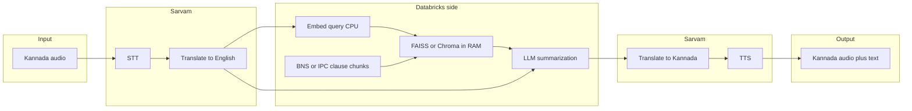

# Nyaya Dhwani: Multilingual Legal RAG App Plan

**Setup:** [README.md](../README.md) (Databricks CLI, `free-aws` profile, secrets, local `pytest`).  
This document is the **canonical plan**; keep it in sync with development.

---

## Current status

| Area | State |
|------|--------|
| **Repo layout** | `notebooks/`, `src/nyaya_dhwani/`, `tests/`, `pyproject.toml`, [`.gitignore`](../.gitignore) |
| **Ingestion** | [`notebooks/india_legal_policy_ingest.ipynb`](../notebooks/india_legal_policy_ingest.ipynb) in git — Delta tables under `main.india_legal`, including `legal_rag_corpus` |
| **Secrets** | Scope `nyaya-dhwani` (`datagov_api_key`, `sarvam_api_key`) or env vars — no keys committed |
| **Notebook fixes** | Sarvam cell syntax (`else` block), safe JSON error handling, corpus prefers `english_summary` for BNS rows |
| **Package** | [`text_utils`](../src/nyaya_dhwani/text_utils.py), [`manifest`](../src/nyaya_dhwani/manifest.py), [`embedder`](../src/nyaya_dhwani/embedder.py), [`index_builder`](../src/nyaya_dhwani/index_builder.py), [`retrieval`](../src/nyaya_dhwani/retrieval.py), [`sarvam_client`](../src/nyaya_dhwani/sarvam_client.py) |
| **RAG index** | [`notebooks/build_rag_index.ipynb`](../notebooks/build_rag_index.ipynb) writes FAISS + Parquet + `manifest.json` under `/Volumes/main/india_legal/legal_files/nyaya_index/` |
| **App UI** | Not built — no `app/main.py` yet |

---

## Recommended default (hackathon MVP)

**Target runtime:** a **[Databricks App](https://docs.databricks.com/en/dev-tools/databricks-apps/index.html)** (Python: FastAPI or Gradio) in the same workspace as the data. Use **Unity Catalog / Volumes**, **Databricks Secrets** for Sarvam + LLM keys, and **shared `src/nyaya_dhwani`** importable from the App and from notebooks.

**Why not vector search on a cluster per query?** On Free Edition, long-lived Spark clusters for interactive FAISS/Chroma are costly. Prefer: **offline index build** (notebook or job) → **persist** FAISS/Chroma + manifest to a **UC Volume** → **load in memory** in the App container at startup.

If **Databricks Apps** are unavailable on the SKU, use a **notebook** with file upload and the same Python modules, or a **job** that runs the pipeline (higher latency).

---

## 1. Align ingestion with retrieval

**Canonical notebook:** [`notebooks/india_legal_policy_ingest.ipynb`](../notebooks/india_legal_policy_ingest.ipynb) (workspace copy may still exist [here](https://dbc-6651e87a-25a5.cloud.databricks.com/editor/notebooks/3612872385018180?o=7474650313055161#command/7489865991491179); **git is source of truth**).

The notebook already materializes **`main.india_legal.legal_rag_corpus`** with columns such as `chunk_id`, `source`, `doc_type`, `title`, `text` (BNS, mapping, schemes). For RAG you still need:

| Artifact | Purpose |
|----------|---------|
| **Embeddings** | Same model at ingest and query (e.g. `sentence-transformers` id or API embedding id) |
| **Vector index** | FAISS + id mapping, or Chroma persist dir, **plus** optional Parquet of chunk metadata |
| **Manifest** | `manifest.json`: model id, embedding dim, UC path to index, schema version, timestamp |

**Action:** Add a notebook section (or job) that reads `legal_rag_corpus`, embeds `text` (or `english_summary` when present), writes index + manifest under e.g. `/Volumes/main/india_legal/legal_files/nyaya_index/` (or dedicated Volume).

---

## 2. Query path (runtime)

1. **Sarvam (inbound)** — STT + Kannada → English per [Sarvam docs](https://docs.sarvam.ai); output `query_en`.
2. **Embed** `query_en` with the **same** model as ingestion.
3. **Retrieve** — load FAISS/Chroma from Volume at cold start; top-k + optional MMR / score floor.
4. **LLM** — prompt: `query_en` + retrieved chunks; cite sections; **not legal advice** disclaimer. One of Gemini / Groq / OpenAI; key in Secrets.
5. **Sarvam (outbound)** — English → Kannada text → TTS; return audio + text.

---

## 3. Repository layout

| Path | Status |
|------|--------|
| `notebooks/india_legal_policy_ingest.ipynb` | Done — ingestion + `legal_rag_corpus` |
| `src/nyaya_dhwani/text_utils.py` | Done |
| `sarvam_client.py`, `embedder.py`, `index_builder.py`, `retrieval.py`, `manifest.py` | Done |
| `llm_client.py`, `pipeline.py` | Planned |
| `app/main.py` | Planned — FastAPI/Gradio |
| `databricks.yml` | Optional — Asset Bundle |
| `tests/` | Done for helpers; extend when RAG modules exist |

---

## 4. Security and compliance

- **Secrets:** `sarvam_api_key`, `datagov_api_key`, future `LLM_API_KEY` in scope `nyaya-dhwani` (or equivalent env vars). Never commit secrets.
- **Disclaimer:** UI + system prompt — informational only, not a substitute for professional legal advice.
- **PII / logging:** Avoid logging raw audio; prefer lengths or hashes.

---

## 5. Free Edition constraints

- Prefer **App CPU** + **Volume-backed index** over always-on clusters for **inference**.
- Run **ingestion / embedding jobs** on short-lived cluster or serverless when supported.
- Expect **cold start** when loading FAISS in the App; optional warmup route.

---

## 6. Phases

| Phase | Scope |
|-------|--------|
| **MVP** | File upload for audio (or text bypass); English RAG + summary; Kannada text + downloadable audio |
| **v2** | Browser microphone (HTTPS), streaming UI, Sarvam rate-limit handling |
| **v3** | Optional **Databricks Vector Search** if SKU/cost allow |

---

## 7. Technical choices

- **FAISS vs Chroma:** FAISS is lean; Chroma helps metadata filters (`source`, `doc_type`).
- **LLM:** Abstract behind `llm_client` for provider swaps.

---

## Summary

**Done:** Ingestion notebook in repo, Delta corpus, secrets pattern, local tests for helpers.  
**Next:** Embedding + vector index + manifest from `legal_rag_corpus`, then `src/nyaya_dhwani` RAG pipeline and Databricks App (or notebook) for Sarvam ↔ retrieve ↔ LLM ↔ Sarvam.

---

## Verification checklist

- [ ] `SHOW TABLES IN main.india_legal` after ingestion
- [ ] Sample `SELECT` on `legal_rag_corpus` with filters on `source`
- [ ] `python3 -m pytest tests/ -q` locally
- [ ] After RAG build: index files + `manifest.json` on Volume; App loads and answers a smoke query
