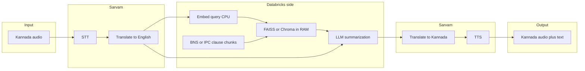

# Nyaya Dhwani: Multilingual Legal RAG App Plan

**Setup:** [README.md](../README.md) (Databricks CLI, `free-aws` profile, secrets, local `pytest`).  
This document is the **canonical plan**; keep it in sync with development.

---

## Current status

| Area | State |
|------|--------|
| **Repo layout** | `notebooks/`, `src/nyaya_dhwani/`, `tests/`, `pyproject.toml`, [`.gitignore`](../.gitignore) |
| **Ingestion** | [`notebooks/india_legal_policy_ingest.ipynb`](../notebooks/india_legal_policy_ingest.ipynb) in git — Delta tables under `main.india_legal`, including `legal_rag_corpus` |
| **Secrets** | Scope `nyaya-dhwani` (`datagov_api_key`, `sarvam_api_key`) or env vars — no keys committed |
| **Notebook fixes** | Sarvam cell syntax (`else` block), safe JSON error handling, corpus prefers `english_summary` for BNS rows |
| **Package** | [`text_utils`](../src/nyaya_dhwani/text_utils.py), [`manifest`](../src/nyaya_dhwani/manifest.py), [`embedder`](../src/nyaya_dhwani/embedder.py), [`index_builder`](../src/nyaya_dhwani/index_builder.py), [`retrieval`](../src/nyaya_dhwani/retrieval.py), [`sarvam_client`](../src/nyaya_dhwani/sarvam_client.py) |
| **RAG index** | [`notebooks/build_rag_index.ipynb`](../notebooks/build_rag_index.ipynb) writes FAISS + Parquet + `manifest.json` under `/Volumes/main/india_legal/legal_files/nyaya_index/` |
| **RAG smoke test** | `CorpusIndex.load` + `search` works in notebook when index + deps are installed |
| **App UI** | Not built — no `app/main.py` yet |
| **MLflow / AI Gateway** | Not wired — optional for tracing, LLM routing, and packaging (see §8) |

---

## Recommended default (hackathon MVP)

**Target runtime:** a **[Databricks App](https://docs.databricks.com/en/dev-tools/databricks-apps/index.html)** (Python: FastAPI or Gradio) in the same workspace as the data. Use **Unity Catalog / Volumes**, **Databricks Secrets** for Sarvam + LLM keys, and **shared `src/nyaya_dhwani`** importable from the App and from notebooks.

**Why not vector search on a cluster per query?** On Free Edition, long-lived Spark clusters for interactive FAISS/Chroma are costly. Prefer: **offline index build** (notebook or job) → **persist** FAISS/Chroma + manifest to a **UC Volume** → **load in memory** in the App container at startup.

If **Databricks Apps** are unavailable on the SKU, use a **notebook** with file upload and the same Python modules, or a **job** that runs the pipeline (higher latency).

---

## 1. Align ingestion with retrieval

**Canonical notebook:** [`notebooks/india_legal_policy_ingest.ipynb`](../notebooks/india_legal_policy_ingest.ipynb) (workspace copy may still exist [here](https://dbc-6651e87a-25a5.cloud.databricks.com/editor/notebooks/3612872385018180?o=7474650313055161#command/7489865991491179); **git is source of truth**).

The notebook already materializes **`main.india_legal.legal_rag_corpus`** with columns such as `chunk_id`, `source`, `doc_type`, `title`, `text` (BNS, mapping, schemes). For RAG you still need:

| Artifact | Purpose |
|----------|---------|
| **Embeddings** | Same model at ingest and query (e.g. `sentence-transformers` id or API embedding id) |
| **Vector index** | FAISS + id mapping, or Chroma persist dir, **plus** optional Parquet of chunk metadata |
| **Manifest** | `manifest.json`: model id, embedding dim, UC path to index, schema version, timestamp |

**Action:** Add a notebook section (or job) that reads `legal_rag_corpus`, embeds `text` (or `english_summary` when present), writes index + manifest under e.g. `/Volumes/main/india_legal/legal_files/nyaya_index/` (or dedicated Volume).

---

## 2. Query path (runtime)

1. **Sarvam (inbound)** — STT + Kannada → English per [Sarvam docs](https://docs.sarvam.ai); output `query_en`.
2. **Embed** `query_en` with the **same** model as ingestion.
3. **Retrieve** — load FAISS/Chroma from Volume at cold start; top-k + optional MMR / score floor.
4. **LLM** — prompt: `query_en` + retrieved chunks; cite sections; **not legal advice** disclaimer. One of Gemini / Groq / OpenAI; key in Secrets.
5. **Sarvam (outbound)** — English → Kannada text → TTS; return audio + text.

---

## 3. Repository layout

| Path | Status |
|------|--------|
| `notebooks/india_legal_policy_ingest.ipynb` | Done — ingestion + `legal_rag_corpus` |
| `src/nyaya_dhwani/text_utils.py` | Done |
| `sarvam_client.py`, `embedder.py`, `index_builder.py`, `retrieval.py`, `manifest.py` | Done |
| `llm_client.py`, `pipeline.py` | Planned |
| `app/main.py` | Planned — FastAPI/Gradio |
| `databricks.yml` | Optional — Asset Bundle |
| `tests/` | Done for helpers; extend when RAG modules exist |

---

## 4. Security and compliance

- **Secrets:** `sarvam_api_key`, `datagov_api_key`, future `LLM_API_KEY` in scope `nyaya-dhwani` (or equivalent env vars). Never commit secrets.
- **Disclaimer:** UI + system prompt — informational only, not a substitute for professional legal advice.
- **PII / logging:** Avoid logging raw audio; prefer lengths or hashes.

---

## 5. Free Edition constraints

- Prefer **App CPU** + **Volume-backed index** over always-on clusters for **inference**.
- Run **ingestion / embedding jobs** on short-lived cluster or serverless when supported.
- Expect **cold start** when loading FAISS in the App; optional warmup route.

---

## 6. Phases

| Phase | Scope |
|-------|--------|
| **MVP** | Text-in English query → retrieve → LLM answer (no audio). Optional **MLflow** trace. |
| **MVP+** | **Databricks App** (FastAPI/Gradio) or notebook-only UI; secrets for LLM; optional **AI Gateway** for governed LLM calls |
| **MVP++** | Sarvam STT/TTS + Kannada; file upload for audio |
| **v2** | Browser microphone (HTTPS), streaming UI, Sarvam rate-limit handling |
| **v3** | Optional **Databricks Vector Search** if SKU/cost allow |

---

## 7. Technical choices

- **FAISS vs Chroma:** FAISS is lean; Chroma helps metadata filters (`source`, `doc_type`).
- **LLM:** Abstract behind `llm_client` for provider swaps.

---

## 8. Build sequence — verify *your* workspace (small pieces)

Do these **in order**. After each step, **note pass / fail** (and any error text). That tells us whether to target **notebook-only**, **Databricks Apps**, **Model Serving**, **AI Gateway**, or **external LLM + MLflow tracing** for your SKU.

### Step 0 — Already done if you followed the repo

| # | Try | Pass criteria |
|---|-----|----------------|
| 0a | Run [`notebooks/india_legal_policy_ingest.ipynb`](../notebooks/india_legal_policy_ingest.ipynb) through `legal_rag_corpus` | `SELECT COUNT(*) FROM main.india_legal.legal_rag_corpus` > 0 |
| 0b | Run [`notebooks/build_rag_index.ipynb`](../notebooks/build_rag_index.ipynb) through index write + smoke cell | `nyaya_index/` contains `corpus.faiss`, `chunks.parquet`, `manifest.json`; `ci.search` returns rows |

**If 0b failed:** fix deps (`faiss-cpu` 1.7.x, `numpy<2`, lazy `get_faiss`) per README — do not start the app layer until search works.

---

### Step 1 — MLflow UI (low risk)

| # | Try | Pass criteria |
|---|-----|----------------|
| 1a | Sidebar: **Machine Learning** → **Experiments** (or **Experiments** in workspace) | UI opens; you can create an experiment, e.g. `/Shared/nyaya-dhwani` |
| 1b | In any notebook: `import mlflow; mlflow.set_experiment("/Shared/nyaya-dhwani"); mlflow.start_run(); mlflow.log_param("probe", 1); mlflow.end_run()` | Run succeeds; run appears in UI |

**If 1b fails:** note the error (MLflow not on cluster / serverless). We can skip MLflow for MVP and add it when compute allows.

---

### Step 2 — Hosted LLM in the workspace (pick what your UI offers)

Product names change; use whatever your workspace lists under **AI/ML**, **Serving**, **Playground**, or **Foundation Model APIs**.

| # | Try | Pass criteria |
|---|-----|----------------|
| 2a | Open **Playground** or **Chat** against a **Databricks-managed** or **external** model | You get one completion without writing an App |
| 2b | In a notebook, run the **smallest documented example** for workspace LLM access (often via `databricks-*` SDK or REST). *Do not commit API output.* | One programmatic completion works |

**Report back:** endpoint type (OpenAI-compatible URL, `serving_endpoint` name, etc.).

**If 2a–2b fail:** MVP can use **external** OpenAI-compatible API with key in **`nyaya-dhwani`** scope (e.g. `openai_api_key`) — same RAG code, different `llm_client` backend.

---

### Step 3 — AI Gateway / governed routing (optional)

| # | Try | Pass criteria |
|---|-----|----------------|
| 3a | Search workspace docs or sidebar for **AI Gateway**, **Inference**, **External models** | You see a way to register or route models |
| 3b | If available, route **one** model through the gateway and call it from a notebook using the **documented** client | Same as 2b, but URL/key pattern is gateway-specific |

**If unavailable:** implement `llm_client` with direct provider first; add gateway later.

---

### Step 4 — Databricks Apps (optional for MVP)

| # | Try | Pass criteria |
|---|-----|----------------|
| 4a | Sidebar: **Apps** or **Compute → Apps** | **Create** or **Deploy** is visible |
| 4b | Deploy a **hello-world** sample app from docs (FastAPI “hello”) | URL opens |

**If 4a fails:** ship **MVP in a notebook** (text box + `display` + RAG function) or a **job** that answers batch queries — still valid for the hackathon.

---

### Step 5 — Code we add after your report

| You confirmed | We add (repo) |
|---------------|----------------|
| Step 2 works (hosted or external LLM) | `src/nyaya_dhwani/llm_client.py` — single interface; pluggable backend |
| Step 1 works | Optional `mlflow.trace` / autolog around retrieve + LLM |
| Step 4 works | `app/main.py` — FastAPI: `POST /ask` → retrieve → LLM → JSON |
| Only Step 0 | Notebook template cell: `def ask(q): ...` using `CorpusIndex` + placeholder LLM |

**Nothing here requires Vector Search** — FAISS on Volume is enough until you outgrow it.

---

## Summary

**Done:** Ingestion notebook, Delta corpus, FAISS index + manifest on Volume, `nyaya_dhwani` retrieval + embedder, lazy FAISS import, Parquet-safe chunks.  
**Next (your turn):** Run **§8 steps 1–4** in small pieces and note what works — then we add **`llm_client` + one query path** (notebook or App) and optional MLflow tracing.

---

## Verification checklist (legacy)

- [x] `SHOW TABLES IN main.india_legal` after ingestion
- [x] Sample `SELECT` on `legal_rag_corpus` with filters on `source`
- [ ] `python3 -m pytest tests/ -q` locally
- [x] After RAG build: index files + `manifest.json` on Volume; notebook `CorpusIndex.search` smoke query
- [ ] §8 Step 1 — MLflow experiment log from notebook
- [ ] §8 Step 2 — one LLM completion (workspace or external)
- [ ] §8 Step 4 — Databricks App hello-world *(optional)*
